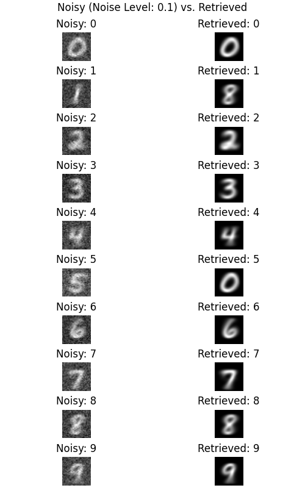
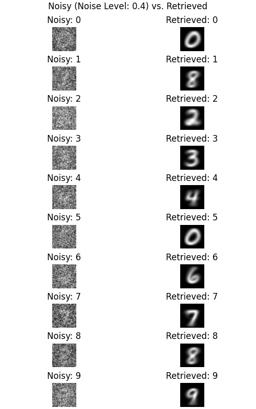
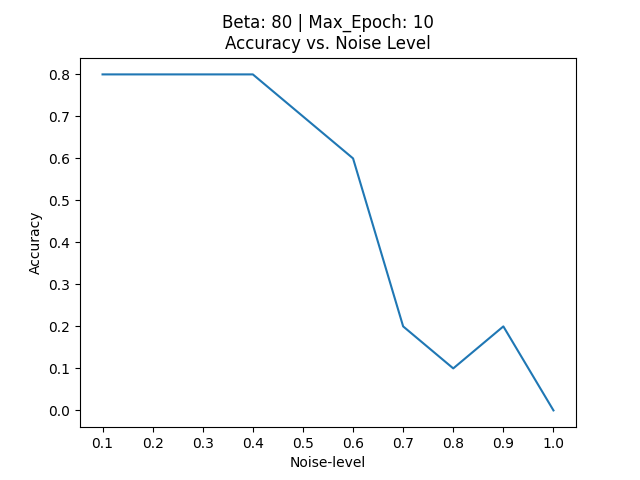
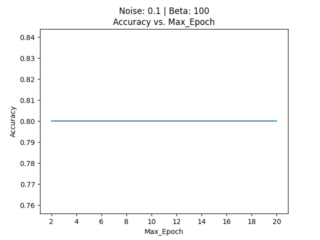

# Modern-hopfield-network
This code implements Modern Hopfield Network using PyTorch. The network takes in two variables, dim for number of nodes and beta, to initialize. Users can test the retrieval of MNIST digits for custom beta, noise level and max epoch. The code also tests how the hyperparameters noise level, beta, and max epoch influences the accuracy of the retrieval of this network. 

By running the code, we can understand some properties of Modern Hopfield Network.

         
Because the noise level is only 10%, the digits in the noised images are easily recognizable by humans. For most of the time, the model can retrieve the correct original image. 

     
In this case, we can’t really make out what the original images should be, but we have the labels here telling us the correct answer. We can see that the model makes more errors, but still the model does better than what we would expect from these static images. Certainly, humans won’t do as well as the model here. Also, the model does better than random which would be a 10% accuracy. So we can see that the model isn’t perfect but it can be more effective than humans and random guessers for certain difficult images. 

Now, let's experiment how each of the hyperparameters noise level, beta, and max epoch influences the accuracy of the network retrieval.

  
Starting with varying the noise level, we fix beta to 80 and max epoch to 10 iterations. As expected, when the noise level increases, the accuracy drops. The model still does as well as the 10% random prediction accuracy.

  
Now let’s change beta. We fix the noise level to 0.1 and max epoch to 10 iterations. We see that as the beta level increases the accuracy of the model increases. Research on beta says with higher beta value, the local minima of stored patterns become distinct and mixtures of multiple stored memories forming local minima becomes unlikely. So we can understand beta as a measure of how distinct the local minima of the network energy are.

     
Finally, let’s change the epoch, beta is fixed at 80 and noise_level is at 0.1. We see max epoch has little relationship with accuracy. This has to do with the fast convergence feature of Modern Hopfield Network. Usually, the network will converge to a local minimum after one update, and hence, after this point, the accuracy does not change.

By now, we have seen hopfield network's retrieval of images and how this retrieval changes as the noise level, beta, and max epoch changes. 